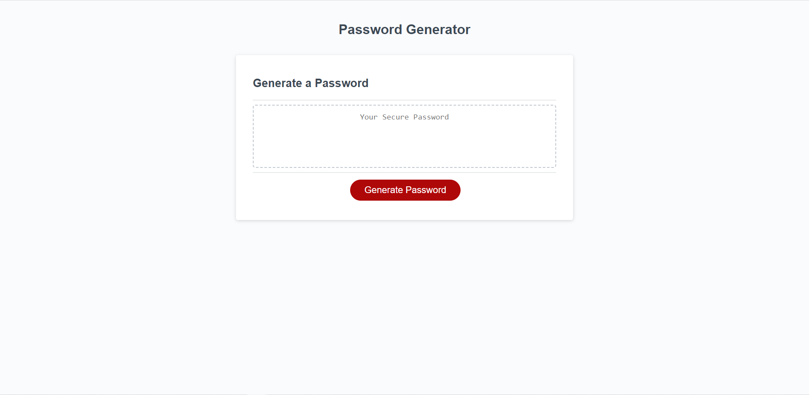

# <Password Generator Page>

## Description

This webpage will allow you to generate a password. The password may include special characters, uppercase letters, lowercase letters and numbers. The page will prompt to user to select how many characters they wish to have (minumum 8 and maximum 128 characters). The page will prompt the user to select what type of characters they wish to include in their password. 

# Link to website

https://scrimmyfs.github.io/Password-generator/

# Screenshot of website

